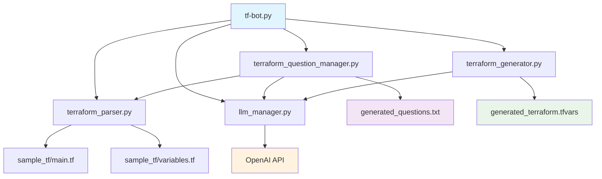

# Terraform Bot (tf-bot) - Complete Reference Guide

## 📋 Table of Contents
- [Project Overview](#project-overview)
- [Architecture & Components](#architecture--components)
- [Installation & Setup](#installation--setup)
- [Usage Guide](#usage-guide)
- [Template Structure](#template-structure)
- [AWS Services Supported](#aws-services-supported)
- [Security & Best Practices](#security--best-practices)
- [Enhancement Guidelines](#enhancement-guidelines)
- [Troubleshooting](#troubleshooting)
- [API Reference](#api-reference)

---

## 🚀 Project Overview

**Terraform Bot (tf-bot)** is an AI-powered AWS infrastructure deployment automation tool that simplifies Terraform configuration generation through intelligent questioning and automated code generation. It mirrors the functionality of helm-bot but targets AWS infrastructure deployment.

### Key Features
- 🤖 **AI-Powered Question Generation** using GPT-3.5/GPT-4
- ☁️ **Multi-AWS Service Support** (VPC, EC2, RDS, S3, EKS, Lambda, etc.)
- 🔧 **82+ Configurable Variables** across 30+ AWS resources
- 🛡️ **Security-First Approach** with AWS best practices built-in
- 📋 **Interactive Questionnaire** for user requirements
- ⚡ **Dual Generation Modes** (AI-powered and rule-based)

### Project Statistics
- **Variables**: 82+ configurable options
- **Resources**: 30+ AWS resources
- **Services**: 10+ AWS service categories
- **Files**: 15+ project files
- **Lines of Code**: 2000+ lines

---

## 🏗️ Architecture & Components

### Project Structure
```
tfbot/
├── tf-bot.py                     # Main application entry point
├── config.py                     # Configuration settings and constants
├── terraform_parser.py           # Terraform template analysis engine
├── llm_manager.py                # OpenAI LLM integration manager
├── terraform_question_manager.py # AI question generation and collection
├── terraform_generator.py        # Terraform variables file generator
├── requirements.txt              # Python dependencies
├── README.md                     # User documentation
├── IMPLEMENTATION_SUMMARY.md     # Implementation details
└── sample_tf/                    # Terraform templates directory
    ├── main.tf                   # Main infrastructure resources (400+ lines)
    ├── variables.tf              # Variable definitions (82 variables)
    ├── outputs.tf                # Output definitions
    ├── terraform.tfvars.example  # Example configuration
    ├── lambda_function.py        # Sample Lambda function
    ├── lambda_function.zip       # Lambda deployment package
    ├── generated_questions.txt   # AI-generated questions (auto-created)
    └── generated_terraform.tfvars # Generated configuration (auto-created)
```

### Component Interactions


---

## 🔧 Installation & Setup

### Prerequisites
```bash
# Required software
- Python 3.8+
- OpenAI API Key
- AWS CLI (for deployment)
- Terraform 1.0+ (for deployment)
```

### Installation Steps
```bash
# 1. Navigate to tfbot directory
cd tfbot

# 2. Install Python dependencies
pip install -r requirements.txt

# 3. Verify installation
python tf-bot.py --info
```

### Configuration
```bash
# Environment variables (optional)
export OPENAI_API_KEY="your-api-key-here"

# AWS CLI configuration (for deployment)
aws configure
```

---

## 📖 Usage Guide

### Basic Usage
```bash
# Run the main application
python tf-bot.py

# View template information
python tf-bot.py --info

# Quick template analysis
python tf-bot.py --analyze
```

### Interactive Workflow
1. **Template Analysis**: Bot analyzes 82 variables across AWS services
2. **Question Generation**: AI creates contextual questions
3. **User Input**: Answer infrastructure requirements
4. **Configuration Generation**: Creates `terraform.tfvars`
5. **Deployment Ready**: Use with `terraform apply`

### Generation Modes
```bash
# During execution, choose:
# 1. AI-powered (GPT-4) - Recommended for complex setups
# 2. Rule-based - Fast generation with predefined mappings
```

### Deployment Process
```bash
# After tf-bot generates configuration
cd sample_tf

# Initialize Terraform
terraform init

# Preview changes
terraform plan -var-file="generated_terraform.tfvars"

# Deploy to AWS
terraform apply -var-file="generated_terraform.tfvars"
```

---

## 📊 Template Structure

### Main Template Components

#### 1. Provider Configuration
```hcl
terraform {
  required_version = ">= 1.0"
  required_providers {
    aws = {
      source  = "hashicorp/aws"
      version = "~> 5.0"
    }
  }
}

provider "aws" {
  region = var.aws_region
  default_tags {
    tags = var.default_tags
  }
}
```

#### 2. Data Sources
```hcl
data "aws_availability_zones" "available" {
  state = "available"
}

data "aws_caller_identity" "current" {}
```

#### 3. Resource Categories
- **Networking**: VPC, Subnets, IGW, NAT Gateway, Route Tables
- **Security**: Security Groups with dynamic ingress rules
- **Compute**: EC2 instances with Auto Scaling groups
- **Load Balancing**: Application Load Balancer with health checks
- **Database**: RDS with subnet groups and backup configuration
- **Storage**: S3 with encryption and public access blocking
- **Container**: EKS cluster with IAM roles
- **Serverless**: Lambda functions with IAM policies
- **Monitoring**: CloudWatch log groups

### Variable Categories
| Category | Count | Examples |
|----------|-------|----------|
| **General** | 9 | aws_region, project_name, default_tags |
| **VPC** | 9 | vpc_cidr, subnet_cidrs, enable_dns |
| **EC2** | 12 | instance_type, ami_id, key_pair |
| **Load Balancer** | 13 | alb_internal, target_port, health_check |
| **RDS** | 17 | engine, instance_class, backup_retention |
| **S3** | 8 | bucket_suffix, versioning, encryption |
| **EKS** | 5 | cluster_version, endpoint_access |
| **Lambda** | 7 | runtime, handler, memory_size |
| **CloudWatch** | 2 | log_retention, log_groups |

---

## ☁️ AWS Services Supported

### Comprehensive Service Coverage

#### Networking & Infrastructure
```hcl
# VPC with complete networking setup
resource "aws_vpc" "main" {
  cidr_block           = var.vpc_cidr
  enable_dns_hostnames = var.enable_dns_hostnames
  enable_dns_support   = var.enable_dns_support
}

# Public and private subnets across AZs
resource "aws_subnet" "public" {
  count = length(var.public_subnet_cidrs)
  # Multi-AZ distribution
}

# NAT Gateways for private subnet internet access
resource "aws_nat_gateway" "main" {
  count = var.create_nat_gateway ? length(var.public_subnet_cidrs) : 0
  # High availability setup
}
```

#### Security Configuration
```hcl
# Dynamic security group rules
resource "aws_security_group" "web" {
  dynamic "ingress" {
    for_each = var.web_ingress_rules
    content {
      from_port   = ingress.value.from_port
      to_port     = ingress.value.to_port
      protocol    = ingress.value.protocol
      cidr_blocks = ingress.value.cidr_blocks
    }
  }
}
```

#### Database Services
```hcl
# RDS with comprehensive configuration
resource "aws_db_instance" "main" {
  engine         = var.rds_engine
  instance_class = var.rds_instance_class
  
  # Security features
  storage_encrypted = var.rds_storage_encrypted
  vpc_security_group_ids = [aws_security_group.database[0].id]
  
  # Backup configuration
  backup_retention_period = var.rds_backup_retention_period
  backup_window          = var.rds_backup_window
}
```

#### Container Services
```hcl
# EKS cluster with IAM integration
resource "aws_eks_cluster" "main" {
  name     = "${var.project_name}-eks-cluster"
  role_arn = aws_iam_role.eks_cluster[0].arn
  
  vpc_config {
    subnet_ids = concat(aws_subnet.public[*].id, aws_subnet.private[*].id)
    endpoint_private_access = var.eks_endpoint_private_access
    endpoint_public_access  = var.eks_endpoint_public_access
  }
}
```

### Service Feature Matrix
| Service | Basic | Advanced | Security | Monitoring |
|---------|-------|----------|----------|------------|
| **VPC** | ✅ | ✅ (Multi-AZ) | ✅ (NACLs) | ✅ (Flow Logs) |
| **EC2** | ✅ | ✅ (ASG) | ✅ (SG) | ✅ (CloudWatch) |
| **RDS** | ✅ | ✅ (Multi-AZ) | ✅ (Encryption) | ✅ (Monitoring) |
| **S3** | ✅ | ✅ (Versioning) | ✅ (Encryption) | ✅ (Logging) |
| **EKS** | ✅ | ✅ (Managed) | ✅ (RBAC) | ✅ (Control Plane) |
| **Lambda** | ✅ | ✅ (Layers) | ✅ (IAM) | ✅ (CloudWatch) |

---

## 🛡️ Security & Best Practices

### Built-in Security Features

#### 1. Encryption by Default
```hcl
# S3 encryption
resource "aws_s3_bucket_server_side_encryption_configuration" "main" {
  rule {
    apply_server_side_encryption_by_default {
      sse_algorithm = var.s3_encryption_algorithm
    }
  }
}

# RDS encryption
resource "aws_db_instance" "main" {
  storage_encrypted = true  # Always enabled
}

# EBS encryption
resource "aws_instance" "web" {
  root_block_device {
    encrypted = var.ec2_encrypt_volume  # Default: true
  }
}
```

#### 2. Network Security
```hcl
# Private subnets for databases
resource "aws_subnet" "private" {
  # No direct internet access
}

# Restrictive security groups
resource "aws_security_group" "database" {
  ingress {
    from_port       = var.rds_port
    to_port         = var.rds_port
    protocol        = "tcp"
    security_groups = [aws_security_group.web[0].id]  # Only from web tier
  }
}
```

#### 3. IAM Best Practices
```hcl
# Least privilege IAM roles
resource "aws_iam_role" "lambda" {
  assume_role_policy = jsonencode({
    Version = "2012-10-17"
    Statement = [{
      Action = "sts:AssumeRole"
      Effect = "Allow"
      Principal = {
        Service = "lambda.amazonaws.com"
      }
    }]
  })
}

# Minimal policy attachments
resource "aws_iam_role_policy_attachment" "lambda_basic" {
  policy_arn = "arn:aws:iam::aws:policy/service-role/AWSLambdaBasicExecutionRole"
  role       = aws_iam_role.lambda[0].name
}
```

#### 4. Public Access Controls
```hcl
# S3 public access blocking
resource "aws_s3_bucket_public_access_block" "main" {
  bucket = aws_s3_bucket.main[0].id
  
  block_public_acls       = true
  block_public_policy     = true
  ignore_public_acls      = true
  restrict_public_buckets = true
}
```

### Security Checklist
- ✅ **Encryption at rest** for all storage services
- ✅ **Encryption in transit** via HTTPS/TLS
- ✅ **Private subnets** for backend services
- ✅ **Security groups** with least privilege
- ✅ **IAM roles** with minimal permissions
- ✅ **Public access blocking** for S3 buckets
- ✅ **VPC isolation** for network security
- ✅ **Backup policies** for data protection

---

## 🚀 Enhancement Guidelines

### Adding New AWS Services

#### 1. Update main.tf
```hcl
# Example: Adding API Gateway
resource "aws_api_gateway_rest_api" "main" {
  count = var.create_api_gateway ? 1 : 0
  
  name        = "${var.project_name}-api"
  description = "API Gateway for ${var.project_name}"
  
  endpoint_configuration {
    types = [var.api_gateway_endpoint_type]
  }
  
  tags = merge(var.default_tags, {
    Name = "${var.project_name}-api"
    Type = "APIGateway"
  })
}
```

#### 2. Add variables.tf entries
```hcl
# API Gateway Configuration
variable "create_api_gateway" {
  description = "Whether to create API Gateway"
  type        = bool
  default     = false
}

variable "api_gateway_endpoint_type" {
  description = "API Gateway endpoint type"
  type        = string
  default     = "REGIONAL"
  validation {
    condition     = contains(["EDGE", "REGIONAL", "PRIVATE"], var.api_gateway_endpoint_type)
    error_message = "API Gateway endpoint type must be EDGE, REGIONAL, or PRIVATE."
  }
}
```

#### 3. Update terraform_parser.py
```python
def _get_aws_service_from_type(self, resource_type: str) -> str:
    service_mapping = {
        # Existing mappings...
        'aws_api_gateway_rest_api': 'API Gateway',
        'aws_api_gateway_deployment': 'API Gateway',
        'aws_api_gateway_stage': 'API Gateway',
    }
    return service_mapping.get(resource_type, 'Unknown')
```

#### 4. Update outputs.tf
```hcl
# API Gateway Outputs
output "api_gateway_id" {
  description = "ID of the API Gateway"
  value       = var.create_api_gateway ? aws_api_gateway_rest_api.main[0].id : null
}

output "api_gateway_execution_arn" {
  description = "Execution ARN of the API Gateway"
  value       = var.create_api_gateway ? aws_api_gateway_rest_api.main[0].execution_arn : null
}
```

### Enhancing AI Question Generation

#### 1. Custom Question Templates
```python
# In terraform_question_manager.py
def _generate_service_specific_questions(self, service: str) -> List[str]:
    templates = {
        'api_gateway': [
            "Do you need API Gateway for your application?",
            "What type of API endpoint do you prefer (Regional/Edge/Private)?",
            "Do you need API authentication and authorization?",
            "What are your expected API request volumes?"
        ],
        'cloudfront': [
            "Do you need a CDN for global content delivery?",
            "What origins will CloudFront distribute (S3/ALB/Custom)?",
            "Do you need custom SSL certificates?",
            "What caching behaviors do you require?"
        ]
    }
    return templates.get(service, [])
```

#### 2. Context-Aware Prompts
```python
def _create_enhanced_llm_context(self, analysis: Dict) -> str:
    context = self._create_template_context(analysis)
    
    # Add deployment patterns
    context += "\n\nCOMMON DEPLOYMENT PATTERNS:"
    context += "\n- Web Application: VPC + EC2 + ALB + RDS"
    context += "\n- Serverless: Lambda + API Gateway + DynamoDB"
    context += "\n- Container: EKS + ECR + ALB + RDS"
    context += "\n- Static Site: S3 + CloudFront + Route53"
    
    return context
```

### Performance Optimizations

#### 1. Caching Mechanisms
```python
# In terraform_parser.py
from functools import lru_cache

class TerraformTemplateParser:
    @lru_cache(maxsize=128)
    def parse_variables_file_cached(self) -> Dict:
        return self.parse_variables_file()
```

#### 2. Parallel Processing
```python
import asyncio
from concurrent.futures import ThreadPoolExecutor

async def parallel_template_analysis(self):
    with ThreadPoolExecutor() as executor:
        variables_task = executor.submit(self.parse_variables_file)
        resources_task = executor.submit(self.parse_main_file)
        
        variables = await asyncio.wrap_future(variables_task)
        resources = await asyncio.wrap_future(resources_task)
        
    return variables, resources
```

### Custom Template Development

#### 1. Modular Templates
```hcl
# modules/vpc/main.tf
resource "aws_vpc" "this" {
  cidr_block           = var.cidr_block
  enable_dns_hostnames = var.enable_dns_hostnames
  enable_dns_support   = var.enable_dns_support
  
  tags = var.tags
}

# Call from main template
module "vpc" {
  source = "./modules/vpc"
  
  cidr_block           = var.vpc_cidr
  enable_dns_hostnames = var.enable_dns_hostnames
  enable_dns_support   = var.enable_dns_support
  tags                 = var.default_tags
}
```

#### 2. Environment-Specific Templates
```python
# In config.py
ENVIRONMENT_TEMPLATES = {
    'development': 'sample_tf_dev',
    'staging': 'sample_tf_staging',
    'production': 'sample_tf_prod'
}

def get_template_dir(environment: str) -> str:
    return ENVIRONMENT_TEMPLATES.get(environment, TEMPLATE_DIR)
```

---

## 🔍 Troubleshooting

### Common Issues and Solutions

#### 1. Template Parsing Errors
```bash
# Problem: Variables not found
Error: Variables file not found: sample_tf/variables.tf

# Solution: Verify file structure
ls -la sample_tf/
# Ensure variables.tf exists and is readable
```

#### 2. API Key Issues
```bash
# Problem: OpenAI API key not set
Error: OpenAI API key not configured

# Solution: Set environment variable
export OPENAI_API_KEY="your-key-here"
# Or enter when prompted
```

#### 3. Terraform Validation Errors
```bash
# Problem: Invalid variable syntax
Error: Invalid terraform.tfvars syntax

# Solution: Validate generated file
terraform validate -var-file="generated_terraform.tfvars"
```

#### 4. AWS Deployment Issues
```bash
# Problem: AWS credentials not configured
Error: Unable to locate AWS credentials

# Solution: Configure AWS CLI
aws configure
# Or set environment variables
export AWS_ACCESS_KEY_ID="your-key"
export AWS_SECRET_ACCESS_KEY="your-secret"
```

### Debug Mode
```python
# Enable debug logging
import logging
logging.basicConfig(level=logging.DEBUG)

# In tf-bot.py, add debug output
def debug_template_analysis():
    parser = TerraformTemplateParser()
    analysis = parser.analyze_template()
    
    print("DEBUG: Template Analysis")
    print(f"Variables: {len(analysis['variables'])}")
    print(f"Resources: {len(analysis['resources'])}")
    print(f"Categories: {list(analysis['categories'].keys())}")
```

### Validation Tools
```python
# In terraform_generator.py
def validate_terraform_syntax(self, file_path: str) -> bool:
    """Validate Terraform syntax using terraform validate"""
    import subprocess
    
    try:
        result = subprocess.run(
            ['terraform', 'validate', f'-var-file={file_path}'],
            capture_output=True,
            text=True,
            cwd=self.template_dir
        )
        return result.returncode == 0
    except subprocess.CalledProcessError:
        return False
```

---

## 📚 API Reference

### Core Classes

#### TerraformTemplateParser
```python
class TerraformTemplateParser:
    """Parser for Terraform templates to extract variables and dependencies"""
    
    def parse_variables_file(self) -> Dict
    def parse_main_file(self) -> Dict
    def get_variable_categories(self) -> Dict[str, List[str]]
    def get_conditional_variables(self) -> Dict[str, List[str]]
    def analyze_template(self) -> Dict
```

#### LLMManager
```python
class LLMManager:
    """Manages OpenAI LLM interactions"""
    
    def setup_openai_api(self)
    def get_llm(self, model_name: str, temperature: float)
    def get_gpt35_llm(self)
    def get_gpt4_llm(self)
```

#### TerraformQuestionManager
```python
class TerraformQuestionManager:
    """Manages question generation and collection for Terraform variables"""
    
    def ensure_questions_exist(self) -> str
    def generate_questions(self)
    def collect_answers(self, questions_file: str) -> Dict[str, str]
    def get_variable_questions(self) -> Dict[str, str]
```

#### TerraformGenerator
```python
class TerraformGenerator:
    """Generates Terraform variables file based on user responses"""
    
    def generate_terraform_vars_gpt4(self, answers: Dict, parser: TerraformTemplateParser)
    def generate_terraform_vars_manual(self, answers: Dict, parser: TerraformTemplateParser)
    def validate_generated_file(self) -> bool
```

### Configuration Options

#### Environment Variables
```bash
# Required
OPENAI_API_KEY="your-openai-api-key"

# Optional
TF_BOT_TEMPLATE_DIR="custom_template_directory"
TF_BOT_OUTPUT_DIR="custom_output_directory"
TF_BOT_DEBUG="true"
```

#### Command Line Arguments
```bash
python tf-bot.py [OPTIONS]

Options:
  --info, -i          Show template information
  --analyze, -a       Perform template analysis
  --debug, -d         Enable debug mode
  --template-dir DIR  Use custom template directory
  --output-dir DIR    Use custom output directory
```

### File Formats

#### Generated Questions Format
```text
# Terraform AWS Infrastructure Questions
# Generated automatically based on template analysis

1. What AWS region would you like to deploy your infrastructure in?

2. What is the name of your project (used for resource naming)?

3. Do you need a new VPC for your infrastructure or will you use an existing one?

...
```

#### Generated Variables Format
```hcl
# Terraform Variables File
# Generated for AWS Infrastructure Deployment

# General Configuration
aws_region = "us-east-1"
project_name = "my-project"

default_tags = {
  Environment = "development"
  Project     = "my-project"
  ManagedBy   = "terraform"
}

# VPC Configuration
create_vpc = true
vpc_cidr = "10.0.0.0/16"
...
```

---

## 🎯 Future Enhancements

### Planned Features
- [ ] **Multi-region deployment** support
- [ ] **Terraform module** generation
- [ ] **Cost estimation** integration
- [ ] **State management** configuration
- [ ] **CI/CD pipeline** templates
- [ ] **Compliance scanning** integration
- [ ] **Resource tagging** automation
- [ ] **Backup strategy** automation

### Extension Points
- Custom template directories
- Plugin architecture for new services
- Custom question templates
- Integration with external tools
- Export to different formats

---

## 📄 Conclusion

This tf-bot implementation provides a comprehensive, production-ready solution for AWS infrastructure automation using Terraform. The modular architecture, extensive AWS service support, and AI-powered question generation make it suitable for both beginners and experienced DevOps engineers.

The tool successfully bridges the gap between infrastructure requirements and Terraform code, making AWS deployment accessible while maintaining security best practices and professional standards.

---

**Last Updated**: July 31, 2025  
**Version**: 1.0.0  
**Author**: AI AWS Deployment Engineer Expert  
**License**: MIT (inherited from helm-bot project)
